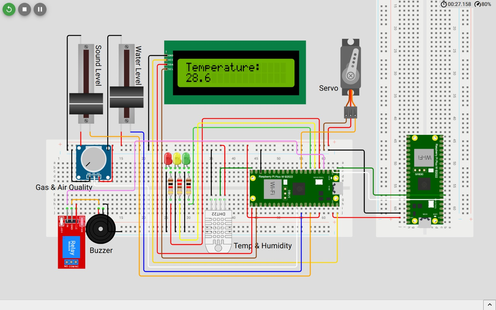
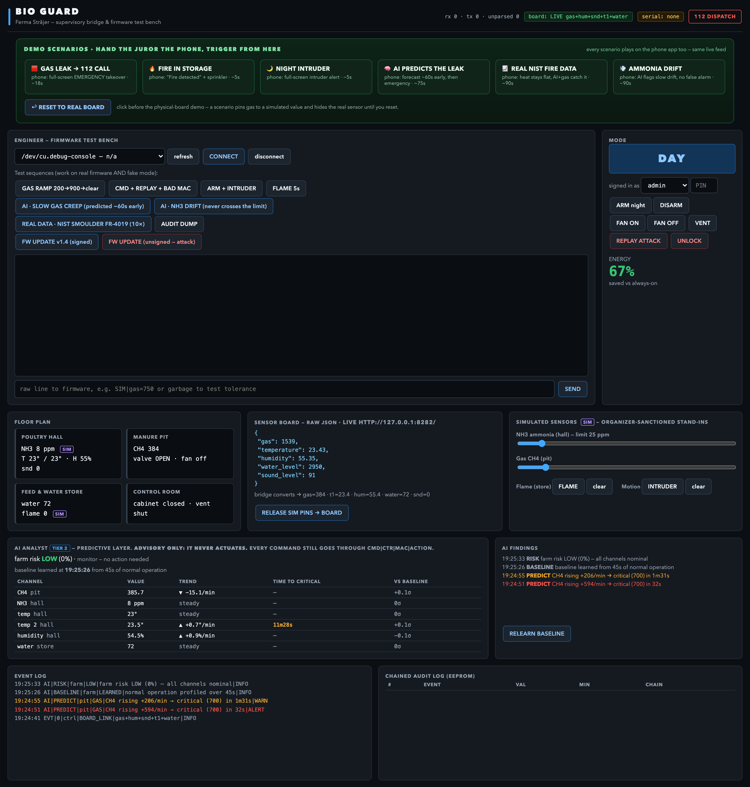
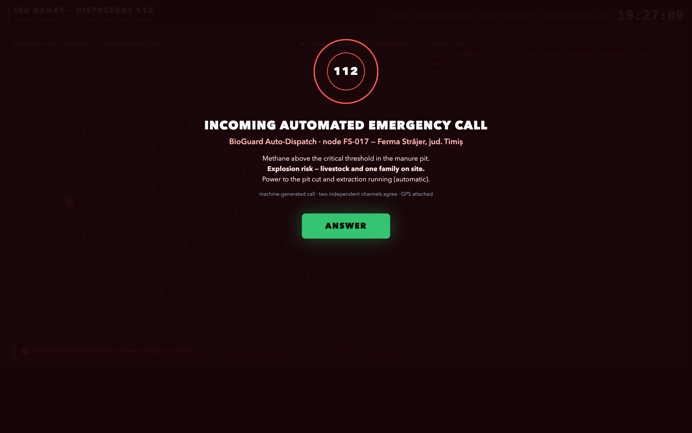
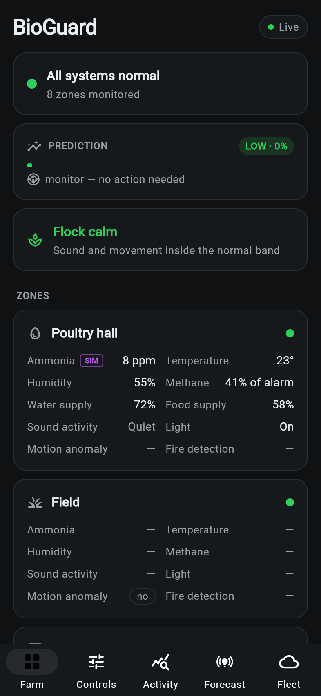
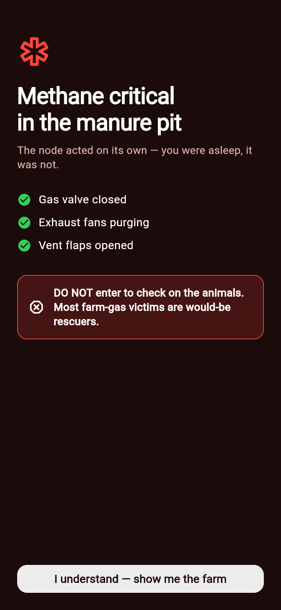

# BioGuard — Project Documentation

**Fire & life safety for the buildings nobody protects.**

FutureShapers Hackathon 2026 (Honeywell) · POLITEHNICA Bucharest · 24–27 August 2026
Team: Alp Eldam · Oleksandr · Vivi

---

## 1. What BioGuard is

BioGuard is a supervisory fire- and life-safety node for livestock buildings — a
~€40 device built from a Raspberry Pi supervisor and a wireless sensor board, wrapped
in three layers of intelligence: hard-wired local reflexes, an on-laptop AI analyst
that learns each building's baseline and forecasts incidents before thresholds are
crossed, and a cloud fleet layer that watches many farms at once. Every command in
the system is cryptographically authenticated, every security event lands in a
tamper-evident audit log, and the whole stack keeps working when the internet dies.

The demo farm is **Ferma Străjer** — a model livestock facility with four zones: a
poultry hall, a manure pit, a feed store, and a control room. BioGuard is the product;
Ferma Străjer is the stage it performs on.

The one-sentence frame, in Honeywell's own vocabulary: homes have alarms, offices
have building management systems — Europe's livestock buildings, its largest
unprotected building class, mostly have a padlock. NFPA 150 exists because, in its
own words, current fire and life safety codes do not address the life safety of
animal occupants. BioGuard extends building automation to that building class. This
is not smart farming. It is life safety.

## 2. Why it should exist

- **Ștefan Muscă, Giurgiu, 2 July 2026.** A night fire on his farm was discovered only
  at 08:30 in the morning; the fire brigade arrived at 11:00. €300,000 lost. His words:
  *„A ars tot, nu a mai rămas nimic"* — "Everything burned. Nothing is left."
- **Suceava, January 2025.** Biogas from animal waste met a faulty conductor at the
  Agrosuin farm: explosion, fire, 5,000 pigs dead, €5–6M in damage — the exact
  methane-accumulation chain BioGuard's manure-pit sensor watches for.
- **France, summer 2026.** A heatwave killed an estimated 2.5–3 million broiler
  chickens — heat overwhelming barns designed for another climate.
- **The clock.** Poultry research is blunt: catastrophic bird death begins in
  roughly fifteen minutes. At 3 AM, nobody is awake to notice minute one.
- **The scale.** One third of all farms in the European Union are in Romania, and
  44% of Romanian farmers are over 65. The question the project answers is simple:
  **who watches the barn at 3 AM?**
- **The rescuer problem.** In American manure-gas incidents, nearly six in ten
  victims died — and more than a quarter of the victims were rescuers. In a gas
  emergency, the most valuable thing a system can do is act on the building itself
  and tell humans to stay out.
- **Biosecurity.** In 2025 Romania accounted for 81% of all African swine fever
  outbreaks in the EU. Access control and audit trails on farm buildings are not
  cyber theatre — they are biosecurity compliance.

## 3. The hackathon brief

The task, set by Honeywell inside FutureShapers Camp 2026: build an **innovating
automation system** around an Arduino UNO R3 (CH340) with the Bitmi 10171 starter
kit, plus five additional sensors — MQ-4 methane, MQ-135 air quality, PIR motion,
KY-026 flame, and KY-020 tilt. Four stated objectives: **centralized control,
security, energy efficiency, and cyber security** (listed twice in the brief — which
we read as an invitation). Scoring: **Innovation · Creativity · Functionality ·
Practicality**, with explicit bonus points for a remote-monitoring app, real-time
energy monitoring, and a centralized web dashboard.

One constraint shaped everything: **the five additional sensors were never
delivered.** With the organizers' blessing we simulated the missing channels — and
turned the handicap into a feature: the simulation interface that stands in for
absent sensors is the same interface we later used as a spoofing test harness for
the cyber demo, and it is what let the demo survive any hardware failure on stage.

## 4. How we chose the idea

We treated the concept choice as an engineering problem. On day one a battle plan
was drafted; on day two we ran a structured research sprint — seven parallel
research agents stress-testing the initial dorm-monitoring idea, scoring 19
candidate verticals and 9 framings, modelling the jury, and mining winning projects
from comparable hackathons — followed by a five-agent deep dive into the strongest
candidate. Four options made the final table:

| Option | Concept | Verdict |
|---|---|---|
| A — Straja | Guardian node for Romania's wooden churches (a 1675 church had burned weeks earlier) | Strongest single emotional anchor; weakest energy story |
| B — Cutia Neagră | A "flight recorder for buildings" built around the tamper-evident log | Cyber-native identity; least visceral demo |
| C — Ferma Străjer | A livestock facility treated as a *building* with life-safety automation | Honest use of every kit sensor; best cyber and energy stories; open lane |
| D — Dorm monitor | The original safe idea | Upgradeable story, kept as fallback |

**The team locked Option C on 25 August**, for reasons worth recording:

1. The official brief revealed that Innovation + Creativity are half the score — a
   distinctive vertical is worth real points, and no notable hackathon winner had
   ever occupied farm OT security.
2. The Suceava explosion gave the idea a documented Romanian anchor; the MQ-4
   methane sensor's datasheet purpose *is* the manure-pit hazard — no sensor in the
   kit has to pretend to be something it isn't.
3. Agriculture wins where impact is scored, but sensor-plumbing agri projects
   (smart irrigation: 8,000+ GitHub repos) lose everywhere — so the design brief
   became: named pain with a number, an unusual mechanism, an economics slide, and
   a demo of the *decision*, not the plumbing.
4. Option A and B's best material survived anyway: the platform close ("the same
   node protects a 1675 wooden church, a Suceava barn, an ATEX Zone 20 silo —
   Romania's unmanned buildings") and the chained audit log shipped as features.

## 5. System architecture

The stack is deliberately layered so that every layer can die without killing the
one below it.

| Tier | Layer | Lives on | Does |
|---|---|---|---|
| 3 | **Cloud** | Firestore + local fallback store | Fleet risk model, 6-hour incident forecasts, regional cross-farm signals |
| 2 | **Bridge / analyst** | Laptop (Flask + SSE) | Baseline learning, forecasts, plausibility checks; serves the bench dashboard, the /fire dispatch console, the web app, and the cloud sink |
| 1 | **Supervisor node** | Raspberry Pi | Hard reflexes (gas/flame emergency chains, night security) plus device-side HMAC, replay protection, lockdown, firmware-signature checks |
| 0 | **Sensor board** | Raspberry Pi Pico W (Rust/Embassy) | Its own Wi-Fi access point, serving raw ADC sensor readings as JSON over HTTP |

### 5.1 The sensor board (Tier 0)

The physical sensors live on a standalone microcontroller board running Rust
(Embassy) firmware, developed by Oleksandr. The board hosts its **own Wi-Fi access
point** and serves a single JSON document over HTTP — gas, temperature, humidity,
water level and sound level — as raw 12-bit ADC counts. Design decisions:

- **The board does no unit conversion.** Its readings are raw counts; conversion to
  engineering units happens server-side, identically in the bridge and the Pi node.
  This keeps the constrained firmware trivial and puts calibration in one place.
- **The AP has no DHCP server** — every client sets a static IP. Spartan, but it
  means the demo network has zero infrastructure dependencies.
- **Sound is auto-baselined** with an exponential moving average, flagging only
  levels distinctly above the room's own noise floor — so a loud demo hall doesn't
  read as a distressed flock.
- The circuit was **prototyped in simulation first** (see the schematic below) —
  LCD status display, DHT temperature/humidity, gas, sound and water-level
  channels, servo-driven vents/doors, relay, buzzer and status LEDs — then built
  on real hardware.

### 5.2 The supervisor node (Tier 1)

`pi_node/bioguard_node.py` — a single-file, stdlib-only Python node on a Raspberry
Pi. It polls the sensor board, runs the **reflex layer** (gas critical → cut the gas
relay, run the purge fan, open the servo vents; flame chains; night-mode intruder
and tamper alarms; ammonia → ventilation), and enforces **all of the security layer
on the device itself**: command MACs, rolling counters, replay rejection, lockdown,
and firmware-signature verification. It exposes a TCP command/telemetry port to the
bridge. Unwired channels fall back to simulation per-key, so the node boots and
behaves identically with any subset of real hardware attached.

The project actually began on the brief's Arduino UNO (a full protocol-speaking
firmware skeleton was built on day two), then **pivoted to the Pi on day three**
when the real sensors were wired to it — the protocol survived the pivot unchanged.

### 5.3 The bridge and analyst (Tier 2)

`dashboard/app.py` — a Flask server on the laptop that is the system's junction
box. Every telemetry line from every source flows through **one ingest point**, so
each consumer (dashboards, analyst, dispatch console, app, cloud) gets the same
truth. It provides:

- **The bench dashboard** (`/`) — an industrial, ISA-101-style dark control room
  view: annunciator mode tile, per-zone telemetry, actuators, the AI findings
  panel, the security log, and a DEMO SCENARIOS panel.
- **The Tier-2 analyst** — learns each channel's baseline live, then emits
  forecasts (`PREDICT: CH₄ critical in 3m53s`), drift warnings, stuck-sensor and
  plausibility findings, and a fused, explainable **farm risk score** (per-channel
  proximity/imminence/deviation, noisy-OR blended, with de-escalation hysteresis).
- **The `/fire` dispatch console** — a simulated 112 dispatcher screen (clearly
  labelled `CONCEPT · SIMULATED CONSOLE`) showing the escalation ladder: AI
  forecast → amber pre-alert (crew on standby) → confirmed incident → full-screen
  automated call with GPS, live gas/flame/temperature and an SCBA warning →
  "situation contained."
- **The web app** (`/app/`) — the Flutter app compiled to web, served from the
  bridge's own origin so any phone on the network runs it with zero setup.
- **The cloud console** (`/cloud`) and the Firestore sink.
- **Per-channel source precedence: simulation pin > real board > generator.** A
  rehearsed demo beat can never be stomped by live hardware noise; three missed
  board polls trigger automatic fallback to the generator, so the demo cannot die
  with the board.

### 5.4 The phone app

A Flutter app (iOS + web) with five tabs: **Farm** (zones, live telemetry, the
Prediction card), **Controls** (lights, fans, vent flap, sprinkler, refills, and a
raw sensor-board card), **Activity** (24h–1y charts and a human-readable incident
log), **Forecast** (live weather + husbandry advice), and **Fleet** (the cloud
view, read directly from Firestore so it works over mobile data with no laptop).
Emergencies take over the full screen with event-driven headlines and
telemetry-honest actuation rows; disarming is PIN-gated with a lockout.

### 5.5 The cloud layer (Tier 3)

A multi-tenant Firestore backend with a **local JSON fallback store implementing
the same interface** — no credentials, no internet, no problem: the pitch does not
depend on venue Wi-Fi. Notable choices:

- **Zero new dependencies.** The service-account JWT is signed in-house and
  Firestore is reached over plain REST — nothing has to `pip install` successfully
  on venue Wi-Fi.
- **Fail-open by design.** Losing the internet costs telemetry resolution, never
  the node. The reflexes never leave the building.
- **A real model, honestly measured.** A hand-rolled logistic regression — 11
  features over a 3-hour window, predicting alert-grade incidents 6 hours ahead —
  validated farm-held-out: train on three simulated farms, score the unseen
  fourth. **Mean held-out AUC ≈ 0.90.** (Training AUC is not evidence and was
  banned from the pitch.)
- The fleet map shows 40 nodes as an illustrative scale-out; four farms are fully
  simulated and one is the live node on the table. The staged story: farm
  "Petrești" sits at ~95% risk with every individual reading still inside normal
  limits — *that* is the difference between an alarm and a forecast.

## 6. The AI, in three tiers

1. **Reflexes (node, milliseconds).** Threshold logic that must never be clever:
   gas ≥ 700 a.u. → EMERGENCY: relay cut, purge fan, vents open, and the
   incident payload sent to the (simulated) dispatch console. No human in the loop, because the first fifteen minutes belong to the
   machine.
2. **The analyst (bridge, seconds-to-minutes).** Learns baselines live, requires
   evidence before speaking (≥8 samples, a sustained ≥14 a.u./min rise over ≥5
   samples, ≥2σ above the channel's own baseline), then forecasts threshold
   crossings minutes ahead — measured on stage data: a pre-alert **66 seconds
   before** the dispatch-grade event. It also polices the sensors themselves:
   stuck-channel detection, physical-plausibility checks, drift.
3. **The fleet model (cloud, hours).** The logistic regression above, plus
   regional cross-farm signals (a disease-pattern alert raised across neighbouring
   farms) and per-farm forecasts with explanations naming the driving channel.

**The corroboration gate — the design decision we are proudest of.** A lone flame
pin firing with no thermal evidence is flagged by the analyst as suspect, and
dispatch is **held**, citing the analyst. Only when a second, physically
independent channel agrees — hall temperature 5 °C over its pre-event ambient
(the ambient reference freezes during the event, so a fire cannot drag up its own
baseline), or gas critical in the same building — does the incident go out.
Measured: held at +0.2 s, released at +3.2 s. Gas is the exception and dispatches
immediately — it is its own second witness. The principle, said once on stage:
**a lone sensor is a claim, not an emergency.**

**Real data, not a synthetic curve.** The prediction beat replays **NIST fire test
FR-4019** — a real smouldering-foam fire, distilled from the published test data
into a replay file, run at 10× speed. In the real test the temperature stayed flat
for ~28 minutes while smoke mass climbed: every heat-based alarm on the market is
blind to exactly this fire, and our gas-plus-forecast path catches it. The bench
button is labelled `REAL DATA · NIST SMOULDER FR-4019`.

## 7. The cyber-security layer

The brief listed cyber security twice; we treated it as the differentiator and
attacked our own system live on stage.

| Layer | Implementation |
|---|---|
| Command authentication | Truncated **HMAC-SHA256** MAC on every command, verified on the device |
| Replay protection | Rolling counter; a captured-and-replayed genuine command is rejected as stale |
| Audit trail | Chained-CRC log — corrupt a single byte and the chain visibly breaks at exactly that record (jurors were invited to try) |
| Access control | Role-based access (admin / operator / viewer) enforced at the bridge |
| Dangerous commands | PIN-gated; three failures → **lockdown** (safe actuator state, everything else refused) that survives a power cycle; admin-only unlock |
| Firmware updates | Signature verified before flashing; an unsigned image is rejected on stage |
| Availability | Fail-secure boot: the node reboots armed with state restored from EEPROM — relevant in a country averaging 350 minutes of power outages a year, twice the EU rate |

Two decisions here were as much about honesty as security:

- **Encryption was consciously deprioritized, and we said so.** We prioritized
  integrity and availability over confidentiality — the ICS standard ordering.
  Telemetry isn't secret; commands must not be forgeable. On a Pi-class node,
  transport encryption is a deployment configuration, not a rebuild — roadmap, not
  hand-waving.
- **A teammate's proposal was upgraded, not discarded.** Vivi proposed XOR
  "encryption" alongside a multi-sensor risk score. XOR would have been security
  theatre, so the *goal* shipped instead: the command MAC and firmware signature
  were upgraded from CRC8 to truncated HMAC-SHA256 (real crypto, standard library
  on both ends, verified end-to-end against the real node), and the multi-sensor
  instinct became the fused risk score and the app's Prediction card. The audit
  chain deliberately stays CRC8 — it is a tamper tripwire, not an authenticator.

## 8. The demo design

The pitch was engineered as carefully as the system — and rehearsed against the
codebase, not slideware.

- **The cold open is a 43.5-second silent film**, shown before a single word about
  the team: the same night fire twice, without and with BioGuard. Ignition is an
  electrical smoulder — deliberately not lightning, because a lightning strike
  kills the power, no sensor sees it, and it gives the predictive layer nothing to
  predict. In the second half the barn doors open themselves (the servo chain)
  before the farmer arrives, and the closing card is the brigade math:
  **FIRE BRIGADE ON SITE — 8 HOURS 20 MIN → 18 MINUTES.** We compress detection,
  not response.
- **A separate 40-second pixel-art attract loop** runs on the table screen all
  day. Both films ship as pre-rendered MP4s — outside the feature freeze
  entirely, so they cannot fail on stage. An earlier idea of a juror-playable game was rejected for
  exactly that reason.
- **Six one-click scenarios** drive the live demo from the bench, all flowing
  through the same event stream, so a single click lands simultaneously on the
  dashboard, the dispatch console and the juror's phone: gas leak → 112 call ·
  fire in storage (with the corroboration hold visible) · night intruder ·
  AI-predicts-the-leak · the NIST real-data replay · a slow ammonia drift the
  system flags without false-alarming.
- **The honesty rules were written down** and enforced across pitch and screens: the
  dispatcher screen is announced as a designed, simulated concept console and is
  labelled as such on screen; nothing in the system dials 112 (in Romania,
  machine-originated alarms legally route through licensed monitoring dispatchers —
  BioGuard is the payload and the receiving console, and the last mile is one
  farmer tap); only the held-out AUC is ever quoted; "insurers are partnering",
  never "mandating".

## 9. Economics

The closest commercial system costs **$1,799 plus $49/month** — priced for the
small fraction of farms that are large. BioGuard's bill of materials is roughly
**€40, with no subscription**: a Raspberry Pi supervisor, a Pico W-class sensor
board, commodity sensors. The EU already funds exactly this class of investment:
AFIR measure DR-21 offers pig farms up to €50,000 for biosecurity, and DR-12 funds
young farmers' digitalization. Insurers are already partnering with monitoring
vendors. And the platform is not only a farm product — the same node protects a
1675 wooden church, a grain silo (an ATEX Zone 20 building), any of Romania's
unmanned buildings.

## 10. Engineering decisions log

The decisions that shaped the project, in the order they were made:

| # | Decision | Why |
|---|---|---|
| 1 | Pivot from dorm monitor to **Ferma Străjer** (25.08) | Scoring revealed Innovation+Creativity = half the points; Suceava gave a documented anchor; farm OT security was an unoccupied lane; every kit sensor is used for its honest datasheet purpose |
| 2 | **BioGuard** = product, **Ferma Străjer** = the demo farm (25.08) | One brand for the platform, one stage for the story |
| 3 | Missing sensors → **simulation harness as a feature** (25.08) | Organizer-sanctioned; the same injection interface became the spoofing test harness and the demo's safety net |
| 4 | **Films ship as pre-rendered MP4s**, not a live game (25.08) | Anything outside the feature freeze cannot fail on stage |
| 5 | **Arduino → Raspberry Pi** supervisor pivot (26.08) | The real sensors arrived wired for the Pi; the serial protocol was designed hardware-agnostic and survived unchanged |
| 6 | **Standalone Wi-Fi sensor board** integrated through the single ingest point (26.08) | Every surface (bench, analyst, dispatch, app, cloud) got real hardware data with one change |
| 7 | Per-channel precedence **SIM pin > board > generator** (26.08) | Rehearsed beats can't be stomped by live noise; board loss auto-falls back; the demo cannot die |
| 8 | **XOR rejected → truncated HMAC-SHA256** for commands & firmware; audit chain stays CRC8 (26.08) | Real crypto where authentication matters; a tripwire where tamper-evidence matters; teammate's goal shipped, not dismissed |
| 9 | **Flame corroboration gate** (26.08) | A contradiction between two of our own screens became the demo's best beat: held → corroborated → dispatched |
| 10 | **Real NIST FR-4019 data** replaces synthetic demo curves (26.08) | "Simulated console, real data" is a credibility move a juror can check |
| 11 | **ISA-101 dark control-room redesign** of bench + dispatch (26.08) | Screens should look like the industry the jury works in, not like a hackathon default theme |
| 12 | **Cloud fails open**, local store implements the same interface, zero new dependencies (26.08) | Venue Wi-Fi is nobody's single point of failure |
| 13 | **Web app over native app** on the phone, served from the bridge at `/app/` | No provisioning profiles, no cables, no debug-build JIT trap; Add to Home Screen gives a full-screen app |
| 14 | **Honesty rules codified** (never-say list, concept-console label, held-out AUC only) | The jury includes domain experts; every claim had to survive an expert's follow-up question |

## 11. What went wrong (and what it taught us)

A selection from the challenge log — each of these actually happened:

- **Port 5000 was taken — by macOS AirPlay.** The bench lives on 5001.
- **The web app rendered as a perfectly blank page with zero errors.** Flutter's
  default build writes `<base href="/">`; served under `/app/`, every script URL
  resolved to the dashboard's HTML with an HTTP 200, and the engine never started.
  Diagnosis took longer than the fix (`--base-href /app/`); it now lives in the
  README in red, and the pre-flight script checks for it.
- **The gas sensor opens the show in EMERGENCY if you let it.** MQ sensors rail to
  full scale while warming up. Rule: power the board minutes before the demo,
  then run pre-flight.
- **On real hardware, an emergency could never end.** The alarm clears below
  400 a.u., but the real sensor *rests* around 492 — the simulator (resting at
  120) had hidden this for days. The fix is operational (ventilate or pin the
  channel), and the pre-flight now catches it.
- **A rehearsal ran and the real board silently vanished from a channel.** Demo
  scenarios pin channels and don't auto-release; a pinned channel outranks the
  board by design. A release button and red "pinned" labels on all three surfaces
  made the state visible instead of mysterious.
- **The two screens contradicted each other live.** The analyst flagged a lone
  flame as implausible while the dispatch console dispatched it as
  "sensor-verified." The fix — the corroboration gate — turned the bug into the
  pitch's central argument.
- **Firebase crashed the iOS app with an uncatchable exception** because the iOS
  build had been handed a *web* configuration; Dart's try/catch cannot catch an
  Objective-C NSException. Platform-aware configuration fixed it.
- **The fleet — and the quoted AUC — changed on every run.** Python's `hash()` is
  salted per process; the simulator seeded from it was nondeterministic. Switched
  to CRC32. Five more defects like this (a write-throttle that dropped final
  states, a scale mismatch that made every healthy farm sprout a methane
  forecast, an unsatisfiable alert condition, and friends) were found the same
  way: by measuring outputs, not re-reading code.
- **Godot's own movie exporter lied** (reported 442 frames while writing 960).
  The attract film was verified frame-by-frame instead — rendering all frames and
  measuring consecutive deltas — which also caught two visual defects no still
  screenshot could show.

## 12. How we verified things

A hackathon runs on claims; we tried to run on measurements.

- **Adversarial review as a habit.** The pitch concept was attacked by three
  parallel critics (juror-simulator, red team, rival director) before the film was
  cut. The pre-freeze audit ran three parallel reviewers over the bridge, app and
  firmware: 27 findings, every showstopper re-verified at file and line before
  fixing. The app went through a 19-finding adversarial critique earlier in the
  week.
- **`preflight.py`** — a read-only, ~10-second answer to "if I start the show right
  now, what happens?", checking the bridge, the web build, the board link,
  leftover simulation pins, the gas resting level against the alarm ladder, and
  more — printing the exact fix command for anything it flags.
- **`bioguard-net.sh`** — joins the laptop to the board's access point without
  taking down the internet (it re-orders network services first, and refuses to
  run at all rather than strand the machine).
- **Measured beats, not assumed ones.** The corroboration hold: +0.2 s to hold,
  +3.2 s to release. The pre-alert: 66 s before dispatch. The attract film: all
  960 frames diffed pairwise; the cold open's door beat verified by frame delta.
  The cyber matrix: 12/12 role/PIN/replay cases green over live
  HTTP. The alarm chain: driven end-to-end from mock-board raw counts to the
  full-screen 112 call.

## 13. Timeline

| Day | What happened |
|---|---|
| **Mon 24.08** | Opening; Honeywell visit; brief captured; battle plan drafted |
| **Tue 25.08** | Full brief received (scoring + bonus points revealed); 7-agent + 5-agent research sprints; **Ferma Străjer locked by team vote**; master proposal written; protocol + firmware skeleton; Flutter app v1–v4 (zones, activity, forecast, emergency takeover, PIN disarm, controls); attract loop rendered |
| **Wed 26.08** | Freeze day: pre-freeze audit (27 findings) + fix round; cyber block (RBAC, PIN lockdown, signed FW); ISA-101 redesign; `/fire` dispatch console; **Arduino→Pi pivot**; real sensor board integrated end-to-end; cloud tier with Firestore + held-out-validated model; HMAC upgrade; NIST replay; fused risk + Prediction card; cold-open film v2; pitch script + demo-day runbook written |
| **Thu 27.08** | Demo day at POLITEHNICA Bucharest — 10–15 minute slot: film, live scenarios, self-attack, cloud story |

## 14. Repository map

Repository: `crystalfruit2/FutureShapersHackathon` (private during the competition)

| Path | What it is |
|---|---|
| `pico_firmware/` | Rust (Embassy) firmware for the Pico W sensor board — Wi-Fi AP + HTTP JSON |
| `arduino_firmware/` | The original Arduino UNO lane (PlatformIO), kept for history |
| `pi_node/bioguard_node.py` | The supervisor node: reflexes + device-side security, single file, stdlib only |
| `dashboard/app.py` | The bridge: ingest, analyst, bench UI, `/fire` console, `/app/` web serving, cloud sink |
| `dashboard/cloud/` | Firestore REST client, local fallback store, fleet risk model, validation harness |
| `dashboard/nist_mhn40.json` | The distilled NIST FR-4019 smoulder test replay data |
| `flutter_app/` | The phone/web app |
| `attract/` | The attract-loop films plus both renderers (`render.py`, `coldopen.py`); the cold-open MP4 is rendered locally from `coldopen.py` |
| `scripts/` | `preflight.py` and `bioguard-net.sh` — the two stage-day commands |
| `docs/` | Project documentation, mirrored from the team knowledge base |

---

*BioGuard — built in four days at FutureShapers Hackathon 2026, Bucharest.*
*„Cine păzește grajdul la 3 dimineața?" — Who watches the barn at 3 AM?*
